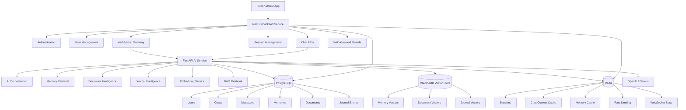

# Architecture Documentation

This document describes the final confirmed architecture of Aura AI.

---

## Final Architecture Flow

```text
Flutter Mobile App
        ↓
NestJS Backend Service
        ↓
FastAPI AI Service
        ↓
PostgreSQL / Redis / ChromaDB
```

---

## Mermaid Architecture Diagram



---

## Layer Responsibilities

### Flutter Mobile App

- mobile UI
- chat screen
- document upload screen
- journal screen
- authentication screens
- profile/settings
- API communication
- WebSocket client

### NestJS Backend Service

- authentication
- user management
- chat APIs
- document metadata APIs
- session handling
- rate limiting
- WebSocket gateway
- database access for backend records
- communication with FastAPI AI service

### FastAPI AI Service

- AI orchestration
- prompt construction
- memory retrieval
- document processing
- journal intelligence
- embedding generation
- ChromaDB vector operations
- RAG retrieval

### PostgreSQL

Permanent structured data:

- users
- chats
- messages
- memories
- documents
- journal entries
- embedding references

### Redis

Temporary fast-access data:

- sessions
- chat context
- memory cache
- rate limiting
- WebSocket state
- temporary AI context

### ChromaDB

Vector embeddings:

- memory vectors
- document chunk vectors
- journal vectors

---

## Chat Request Flow

```text
User sends message in Flutter
        ↓
NestJS validates token/session
        ↓
NestJS stores or loads chat metadata
        ↓
NestJS forwards AI request to FastAPI
        ↓
FastAPI retrieves memory/document context
        ↓
FastAPI builds prompt
        ↓
FastAPI calls LLM provider
        ↓
Response returned to NestJS
        ↓
NestJS saves response
        ↓
Flutter displays response
```

---

## Document RAG Flow

```text
User uploads document
        ↓
NestJS receives upload request
        ↓
FastAPI extracts text
        ↓
Text split into chunks
        ↓
Embeddings generated
        ↓
Vectors stored in ChromaDB
        ↓
Document metadata stored in PostgreSQL
        ↓
User can ask document questions
```

---

## Memory Flow

```text
Conversation happens
        ↓
FastAPI identifies useful memory
        ↓
Memory saved in PostgreSQL
        ↓
Embedding generated
        ↓
Vector stored in ChromaDB
        ↓
Memory retrieval cached in Redis
```

---

## MVP Decisions

- NestJS handles backend services.
- FastAPI handles AI/vector/RAG services.
- PostgreSQL stores permanent data.
- Redis stores cache/session/rate-limit data.
- ChromaDB is used for MVP vector storage.
- Pinecone is future production option.
